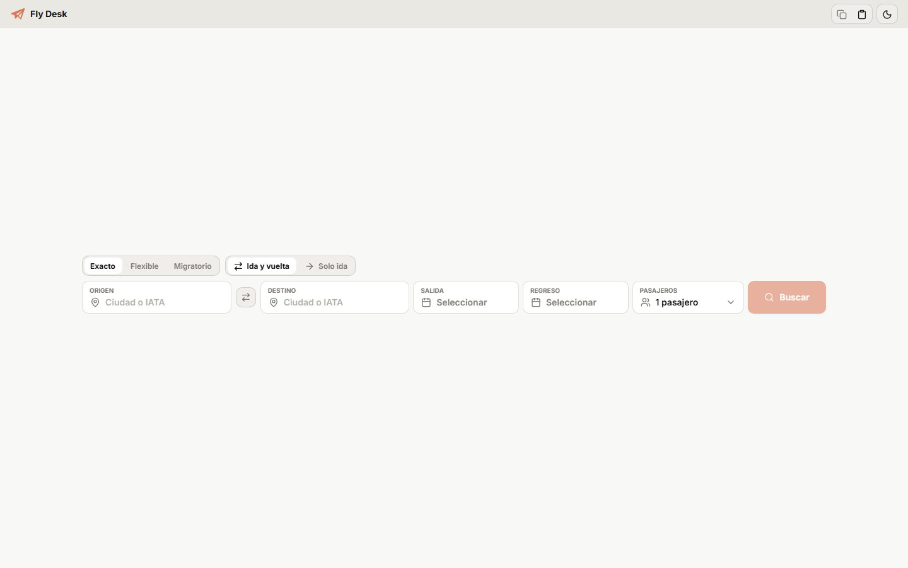

# Fly Desk

> **Status:** under active development. The application, build, and automated suites are functional; operational deployment and provider sessions remain private.

A private web workspace for travel agents to search, compare, and quote flights.

The repository contains no credentials, browser sessions, or operational data. A fresh installation can build and run the interface, but real searches require authorized access to the configured providers.



Fly Desk is a Bun-only application prepared for VPS deployment:

- a Bun server (`Bun.serve`) that serves the private web UI and API
- an optional dedicated Bun process that runs searches on loopback and isolates provider load from login/UI
- an optional dedicated Bun process that resolves `/r/<id>` from the SQLite cache without loading the main runtime
- a desktop React frontend in `frontend/`, built with `Bun.build` and served from `frontend/dist`
- web authentication with a signed httpOnly cookie
- Agil integration that reuses a real Chrome session when available on the host
- Click and Book Plus integration using environment-controlled context and B2B warm-up when applicable
- SQLite persistence through `bun:sqlite`: expiring caches for sessions, matrices, purchase paths, autocomplete, and per-browser recent locations, plus a permanent global route ranking

## Current Scope

- exact search
- flexible one-way range search
- flexible round-trip search through `/api/matrix`, normalized into a results list
- exhaustive monthly migratory search: queries every day in the selected months against Agil and Click and Book Plus without fare filters and processes months in batches
- all searches wait for Agil and Click and Book Plus and retain their complete results; concurrency regulates batch requests rather than trimming available offers
- exact search publishes a stable set after both providers finish; range, matrix, and migratory searches send deltas and publish geometric milestones (1, 2, 4...) coalesced for 900 ms, plus the final state, without remounting visible cards
- origin and destination autocomplete with explicit city/airport types
- up to three recent origins/destinations per browser session and three frequent origins/destinations from permanent global counters, recorded by the backend when a search is accepted
- an idle provider rail that names the providers the desk searches, always and without health copy; readiness stays on the authenticated `/api/provider-status` surface that the router uses internally
- visible filters for stops, maximum layover time, baggage, and airlines
- paginated results with backend warnings
- a side panel with details, known conditions, purchase paths, and quotation from the shared core; the first quote calls `/api/quotation`, requires a complete provider-validated response for the exact stored flight, and may reuse it for at most 15 minutes before revalidation; the migratory switch updates that same verified offer immediately through the shared compositor

The current React UI does not expose:

- multi-city search
- a dedicated calendar/matrix view
- `reprice`
- simulated controls or placeholders for disconnected flows

## Runtime and Security

- The server listens on `127.0.0.1` by default.
- In production it must remain behind Caddy with `HOST=127.0.0.1`.
- `FLY_DESK_WEB_AUTH=1` enables web login with an httpOnly cookie.
- Login admission rejects the sixth failed attempt for one client within 15
  minutes with `429` and `Retry-After` before running scrypt. A successful
  login resets only that client's bucket. Pages overwrites the login client IP
  from Cloudflare's initial request, and Bun accepts it only through a loopback
  peer after IP validation. The in-memory map is capped at 1,024 clients; a
  missing identity uses one bounded fallback bucket.
- `FLY_DESK_TRUST_LOOPBACK_CLIENT=0` is mandatory when using a local reverse proxy.
- If `FLY_DESK_TRUST_LOOPBACK_CLIENT=1` is enabled for direct local use, requests with proxy headers (`x-forwarded-for`, `forwarded`, `x-real-ip`) are not treated as local unless `FLY_DESK_TRUST_REVERSE_PROXY_LOOPBACK=1` is also deliberately configured.
- Operational endpoints accept a valid web cookie or `FLY_DESK_API_TOKEN`.
- Diagnostics, Click and Book Plus token status, and local browser launch remain loopback-only surfaces.
- The normal date window moves from `today` to `today + SEARCH_MAX_FUTURE_DAYS`; round trips are limited to 90 nights, searches to nine passengers, and lap infants to one per adult. The same limits are embedded in the public runtime contract.
- Click and Book Plus does not accept `apiBaseUrl` or `brandBaseUrl` per request; base URLs come from the environment and pass through an allowlist.
- Agil depends on a real Chrome session and a subscription key resolved from the environment or the Agil bundle. Linux/VPS defaults to the platform CDP endpoint on `127.0.0.1:9222`; explicit `AGIL_BROWSER_*` values override it, while Windows keeps discovery explicit.
- Provider fields remain unknown when absent: the normalizers do not synthesize carrier, flight number, seat count, or baggage evidence.
- In production, `fly-desk.service` can delegate `/api/search`, `/api/matrix`, polling, cancellation, quotation, and `/api/provider-status` to `fly-desk-search.service` through `FLY_DESK_SEARCH_SERVICE_URL`; that runner stays on loopback and runs providers/workers.
- With delegation enabled, the web runtime initializes the session cache lazily: autocomplete and preferences do not restore the runner's heavy state.
- Search admission uses capacity units in the runner: default budget `4`, exact searches cost `1`, and range and matrix searches cost `2`. This permits two simultaneous heavy searches; excess work queues with a timeout.
- Price reuse expires from `searchMeta.completedAt`; reads and polling do not renew a fare. A separate idle TTL preserves operational sessions and redirects.
- Completed resident jobs share a default 128 MiB budget. LRU excess leaves RAM after a short grace period but remains in SQLite with its `/r/<id>` paths until TTL expiry; active searches are never evicted.
- Active progress uses the same geometric milestones to bound RAM/HTTP/SQLite snapshots. New purchase paths persist separately so `/r/<id>` works between checkpoints, and every terminal state is durable.
- The web server limits incoming bodies to 1 MiB and materializes each body once to rebuild a trusted request. Delegation reuses that stream without a second copy and retains a bounded timeout during the response. Do not lower `FLY_DESK_SEARCH_SERVICE_TIMEOUT_MS` below the operational default.
- The stop-search button, tab close/navigation, and orderly process shutdown cancel remote jobs. Tab close and shutdown first materialize any pending delta and request a partial cache to preserve resolved results and purchase paths.
- Public purchase paths are served as `/r/<id>` to preserve caching without persisting sensitive links in the UI. Agil responds with a direct provider `302`; Click and Book Plus authenticates its branded purchase URL with a token in the query string, so the local handoff validates or refreshes it immediately before `302` and never persists or logs that resolved URL.
- Price-only matrix coverage remains coverage: neither the frontend nor `/api/quotation` turns it into a synthetic flight. Transport normalizers require a positive price, currency, and real itinerary before exposing an offer.
- In production, the platform can route `/r/*` to `fly-desk-redirect.service`, a separate Bun process that reads `FLY_DESK_SESSION_DB_PATH`. Browser requests use a distinct HttpOnly session cookie scoped to `/r`; the main web cookie and bearer credentials are not forwarded to this service. Loopback and fixed API-token access remain available for controlled smokes.

## Dependencies

Bun is the supported package manager. Do not add `package-lock.json`, `pnpm-lock.yaml`, or `yarn.lock` to this repository.

- Installation: `bun install --frozen-lockfile`
- Lockfile: `bun.lock`
- Typecheck and build: TypeScript 7 through `@typescript/native`; ESLint retains TypeScript 6 as a compatibility API until TypeScript 7 exposes a stable programmatic API. Neither dependency is part of the VPS runtime.
- Workspace: `package.json` with `workspaces: ["frontend"]`
- Hardening: `bunfig.toml` disables dependency lifecycle scripts and filters versions published less than three days ago.
- Additional guardrail: `.npmrc` sets `ignore-scripts=true` for accidental npm/pnpm installations; this does not make pnpm part of the normal project workflow.
- A dependency that needs installation scripts must be deliberately added to `trustedDependencies`, with the reason documented.

## Structure

### Frontend

- `frontend/src/App.tsx`: main workspace composition
- `frontend/src/components/`: top bar, search shell, results, details, and UI components
- `frontend/src/components/results/`: result card, presentation model, migration coverage, and schedule alternatives
- `frontend/src/hooks/`: search/polling and autocomplete
- `frontend/src/lib/api.ts`: BFF HTTP client
- `frontend/src/index.css`: tokens, layout, light/dark themes, and visual states
- `frontend/public/`: static assets copied to `frontend/dist`
- `frontend/dist/`: generated artifact served by the backend

### Backend

- `src/server.ts`: Bun HTTP server, headers, body limit, and `frontend/dist` serving
- `src/redirect-service.ts` / `src/redirect-index.ts`: dedicated `/r/<id>` resolver that processes redirects without the main runtime
- `src/http-router.ts`: HTTP BFF, authentication routes, API, and loopback/token surfaces
- `src/web-auth.ts`: web password, signed cookie, and session validation
- `src/search-date-policy.ts`: shared date policy and embedded public configuration
- `src/provider-context.ts`: Click and Book Plus context, allowlist, Chrome/CDP recovery, and live status
- `src/local-agil.ts`: local session, exact/range/matrix search, pricing, and Agil deep links
- `src/local-costamar.ts`: Click and Book Plus client, exact/range/matrix search, branded links, and B2B warm-up
- `src/providers/costamar/search-payloads.ts`: Click and Book Plus payloads; `costamar` remains as a legacy internal alias
- `src/core/`: normalization, matrix, native schedule groups, ranking, quotation/parser, search limits, and shared contracts
- `src/search-service-client.ts`: optional loopback delegation of search, quotation, and provider-status routes to the dedicated runner
- `src/search-worker-client.ts` / `src/search-worker.ts`: Bun child processes that isolate heavy searches
- `src/session-store.ts`: live jobs, resident budget, local SQLite, redirects, and purchase paths
- `src/location-suggestion-cache.ts`: bounded SQLite autocomplete cache with query/session/global caps
- `src/location-usage-store.ts`: permanent global frequency counters plus 24-hour per-session recent locations; reads stay coherent between the web and search processes
- `src/provider-status.ts`: sanitized in-memory provider readiness tracker with closed states/reasons and evidence precedence
- `src/runtime-paths.ts`: persistent path resolution; `FLY_DESK_APP_DATA_DIR` keeps caches outside the release when no specific override is set

## Configuration

`.env.example` is the operational reference for variables. The most common are:

- Runtime/API: `HOST`, `PORT`, `FLY_DESK_API_TOKEN`, `FLY_DESK_SERVER_IDLE_TIMEOUT_SECONDS`, `FLY_DESK_SEARCH_SERVICE_URL`, `FLY_DESK_SEARCH_SERVICE_API_TOKEN`, `FLY_DESK_SEARCH_SERVICE_TIMEOUT_MS`, `FLY_DESK_REDIRECT_HOST`, `FLY_DESK_REDIRECT_PORT`, `FLY_DESK_REDIRECT_CACHE_LOOKUP_TIMEOUT_MS`
- Web auth: `FLY_DESK_WEB_AUTH`, `FLY_DESK_WEB_PASSWORD_HASH`, `FLY_DESK_WEB_SESSION_SECRET`, `FLY_DESK_TRUST_LOOPBACK_CLIENT`, `FLY_DESK_TRUST_REVERSE_PROXY_LOOPBACK`
- Search/persistence: `SEARCH_MAX_FUTURE_DAYS`, `SEARCH_REVALIDATION_CACHE_TTL_MS`, `SEARCH_COMPLETED_SESSION_TTL_MS`, `SEARCH_COMPLETED_SESSION_RESIDENT_BUDGET_BYTES`, `FLY_DESK_QUOTATION_RATE_TIMEOUT_MS`, `FLY_DESK_SESSION_DB_PATH`, `FLY_DESK_LOCATION_SUGGESTION_DB_PATH`, `FLY_DESK_LOCATION_USAGE_DB_PATH`, `FLY_DESK_MIGRATION_CONCURRENT_MONTHS`, `FLY_DESK_SEARCH_CAPACITY_UNITS`, `FLY_DESK_SEARCH_EXACT_COST_UNITS`, `FLY_DESK_SEARCH_RANGE_COST_UNITS`, `FLY_DESK_SEARCH_MATRIX_COST_UNITS`, `FLY_DESK_SEARCH_MAX_QUEUED`, `FLY_DESK_SEARCH_QUEUE_TIMEOUT_MS`
- Application data: `FLY_DESK_APP_DATA_DIR`, `FLY_DESK_QUOTATION_RATE_CACHE_PATH`
- Workers/prewarm: `FLY_DESK_SEARCH_WORKER_PROCESSES`, `FLY_DESK_DISABLE_BACKGROUND_SEARCH_JOBS`, `FLY_DESK_PROVIDER_PREWARM`
- Agil: `AGIL_APIM_SUBSCRIPTION_KEY`, `AGIL_CHROME_USER_DATA_DIR`, `AGIL_CHROME_PROFILE`, `AGIL_BROWSER_URL`, `AGIL_RAW_CHROME_STORAGE_FILE_SCAN`, `AGIL_TEMP_CHROME_STORAGE_FALLBACK`, `AGIL_HTTP_TIMEOUT_MS`
- Click and Book Plus: `CBPLUS_SEARCH_API_BASE_URL`, `CBPLUS_BRAND_BASE_URL`, `CBPLUS_ENGINE_API_BASE_URL`, `CBPLUS_MARKUP_API_BASE_URL`, `CBPLUS_AIR_API_BASE_URL`, `CBPLUS_TERMINAL_ID`, `CBPLUS_TOKEN`
- Click and Book Plus B2B: `CBPLUS_B2B_BASE_URL`, `CBPLUS_B2B_EMAIL`, `CBPLUS_B2B_PASSWORD`, `CBPLUS_B2B_TOTP_SECRET`, `CBPLUS_B2B_TOTP_URI`, `CBPLUS_B2B_AUTOMATION_ENABLED`, `CBPLUS_SESSION_WARMUP_ENABLED`; the base URL must use HTTPS on the exact `b2b.clickandbook.com` origin, and equivalent `COSTAMAR_*` variables remain supported as legacy fallbacks

`CBPLUS_B2B_TOTP_SECRET` accepts Base32, `otpauth://...`, `otpauth-migration://...`, and JSON with `totpUri`; Fly Desk generates the OTP, so do not store temporary codes.

Production must keep `FLY_DESK_SEARCH_WORKER_PROCESSES=1` except during a temporary QA exception. Repeat external QA before considering changes to worker count or warm-up stable.

### Secrets

`.env` is not versioned. To generate the web password hash:

```bash
bun run auth:hash
```

The command uses a hidden terminal prompt. For controlled automation, provide
the password only through standard input from the secret manager. Plaintext
arguments and `FLY_DESK_WEB_PASSWORD` input are rejected so the password does
not enter command arguments, environment assignments, shell history, or logs.
Use only the resulting hash as `FLY_DESK_WEB_PASSWORD_HASH`.
The runtime accepts only a well-formed scrypt hash in that variable; plaintext
and legacy SHA-256 password configurations leave web authentication unavailable.

When working on another machine, do not send `.env` as plaintext through chat, email, or commits. In practice:

- store long-lived secrets in a password manager or secret manager: `FLY_DESK_WEB_SESSION_SECRET`, `FLY_DESK_WEB_PASSWORD_HASH`, `AGIL_APIM_SUBSCRIPTION_KEY`, `CBPLUS_B2B_*` credentials, TOTP/otpauth, and `FLY_DESK_API_TOKEN` when applicable
- recreate Chrome and cache paths per host (`*_CHROME_USER_DATA_DIR` and `FLY_DESK_APP_DATA_DIR`; use `*_DB_PATH` overrides only when files must be separated)
- avoid transferring session tokens such as `CBPLUS_TOKEN`; regenerate them through login/warm-up on the new machine
- if the complete file must be moved, use an encrypted file for yourself, such as a secure password-manager attachment, SOPS/age, or GPG, never a plaintext `.env`

## Scripts

- `bun run dev`
- `bun run build`
- `bun run start`
- `bun run start:search`
- `bun run start:redirect`
- `bun run auth:hash`
- `bun run typecheck`
- `bun run lint`
- `bun run test`
- `bun run test:unit`
- `bun run test:integration`
- `bun run test:core`
- `bun run test:ui`
- `bun run test:coverage`
- `bun run demo`

## Verification

For code or runtime changes:

```powershell
bun install --frozen-lockfile
bun run typecheck
bun run lint
bun run build
bun run test
```

For documentation-only changes, use at least:

```powershell
git diff --check
rg -n "\]\([^)]*\.md\)" README.md docs frontend/README.md
```

## CI

GitHub Actions runs `.github/workflows/ci.yml` on pull requests, pushes to `main`, and manual dispatch. The gate separates core and UI into parallel jobs: core runs typecheck, lint, build, and Bun tests; UI installs Chromium, builds the frontend, and runs browser flows. UI failures publish screenshots as artifacts.

## Current Documentation

- [`docs/REPO_CURRENT_STATE.md`](./docs/REPO_CURRENT_STATE.md): current functional and technical state
- [`docs/DEPLOY_APP.md`](./docs/DEPLOY_APP.md): Fly Desk application deployment and rollback
- [`docs/AGIL_SESSION_RECOVERY.md`](./docs/AGIL_SESSION_RECOVERY.md): Agil session recovery in VPS Chrome/CDP
- [`docs/CBPLUS_SESSION_RECOVERY.md`](./docs/CBPLUS_SESSION_RECOVERY.md): secure Click and Book Plus regeneration and recovery without copying a session
- [`docs/FRONTEND_IDENTITY.md`](./docs/FRONTEND_IDENTITY.md): React visual identity and UI rules
- [`docs/REDESIGN_CONTRACT.md`](./docs/REDESIGN_CONTRACT.md): what the search redesign commits the code to, where it departs from the design manual, and what is still missing
- [`docs/TESTING.md`](./docs/TESTING.md): test classification, execution, and relevance criteria
- [`frontend/README.md`](./frontend/README.md): brief frontend workspace notes

## Deployment

The application is deployed as a private Bun service behind Caddy:

- `HOST=127.0.0.1`
- `FLY_DESK_WEB_AUTH=1`
- `FLY_DESK_TRUST_LOOPBACK_CLIENT=0`
- `FLY_DESK_SEARCH_WORKER_PROCESSES=1`
- `FLY_DESK_SEARCH_SERVICE_URL` points to the dedicated runner when the platform installs `fly-desk-search.service`
- `FLY_DESK_COOKIE_SECURE=1`
- Agil uses `fly-desk-chrome.service` with Chrome CDP on `127.0.0.1:9222`; it still requires a valid Agil session in that profile
- Click and Book Plus is more portable, but its session flows remain intended for controlled use

See [`docs/DEPLOY_APP.md`](./docs/DEPLOY_APP.md) for details.

The current source of truth for Caddy, shared systemd, Caddy rollback, and the platform plan is `grumitos/vps-platform` (`D:\Dev\VPS\vps-platform`). This repository maintains application code and the `fly-desk` deployment.

Repeatable deployment lives in `.github/workflows/deploy-vps.yml` as a manual workflow with `deploy` and `rollback` modes. Each deployment writes `REVISION` with the activated SHA, restarts `fly-desk.service`, restarts `fly-desk-search.service` and `fly-desk-redirect.service` when they already exist, preserves `fly-desk-chrome.service`, and runs local and public smokes. SSH secrets and infrastructure values are configured in GitHub Secrets/Variables, not in the repository.

The public smoke may return `403` from runners or clients outside Peru while the regional restriction in `vps-platform` is active. That restriction covers `/login` and the application before requests reach Fly Desk. The primary operational signal is `Fly Desk Production Smoke` in `vps-platform`, which tests local health, a completed search, `/r/*` for Agil and Click and Book Plus, cancellation, and active services.
