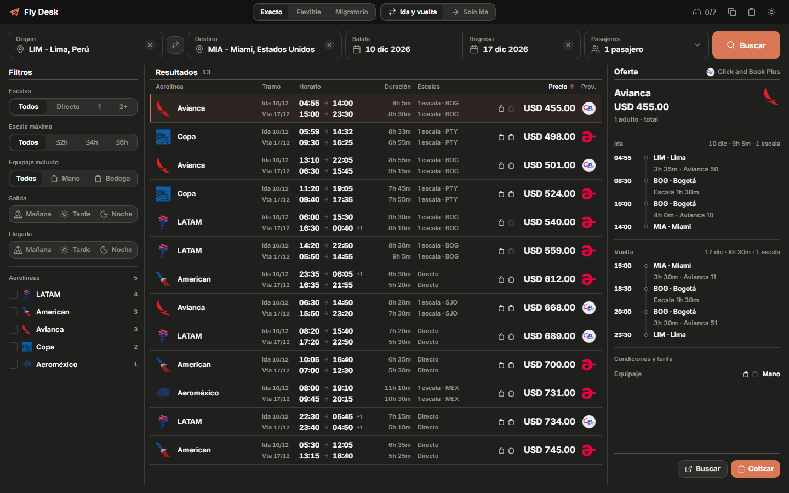

# Fly Desk

> **Status:** under active development. The application, build, and automated suites are functional; operational deployment and provider sessions remain private.

A private web workspace for travel agents to search, compare, and quote flights.

The repository contains no credentials, browser sessions, or operational data. A fresh installation can build and run the interface, but real searches require authorized access to the configured providers.



Fly Desk is a Bun-only application prepared for VPS deployment:

- a Bun server (`Bun.serve`) that serves the private web UI and API
- an optional dedicated Bun process that runs searches on loopback and isolates provider load from login/UI
- an optional dedicated Bun process that resolves `/r/<id>` from the SQLite cache without loading the main runtime
- a React frontend in `frontend/` with desk, tablet and phone layouts, built with `Bun.build` and served from `frontend/dist`
- web authentication with a signed httpOnly cookie
- Agilsmart integration that mints its bearer from a persisted account identity, and reads the session of a real Chrome over DevTools only to create that identity
- Click and Book Plus integration using environment-controlled context, a token the platform renews, and B2B warm-up when applicable
- SQLite persistence through `bun:sqlite`: expiring caches for sessions, matrices, purchase paths, autocomplete, and per-browser recent locations, plus a global station ranking over a rolling 30-day window

## Current Scope

- exact search
- flexible one-way range search
- flexible round-trip search through `/api/matrix`, normalized into a results list
- exhaustive monthly migratory search: queries every day of up to twelve selected months against Agil and Click and Book Plus without fare filters and processes months in batches
- all searches wait for Agil and Click and Book Plus and retain their complete results; concurrency regulates batch requests rather than trimming available offers
- every search mode publishes its partial results as they resolve: deltas, published at most once per 900 ms and only on geometric milestones (1, 2, 4, 8…), plus the final state, without remounting visible cards
- a provider that answered part of a search is named in one line above the results, «Resultados incompletos · Agilsmart respondió en parte», with the rest of the list kept; one that answered no part of it is named as a provider that is down, for example «Resultados incompletos · Agilsmart no respondió». A migratory sweep's line reads its months the same way
- origin and destination autocomplete with explicit city/airport types
- up to three recent origins/destinations per browser session, and three frequent ones from one global ranking: uses in the last 30 days, with the last card kept for the station used most recently. The backend records a route when it accepts a search
- an idle provider rail that names the providers the desk searches, always and without health copy; readiness stays on the authenticated `/api/provider-status` surface that the router uses internally
- a shareable search URL: every search writes its parameters onto the address bar. Opening a link to an exact search whose route and dates the form would accept runs it, once; any other link — a flexible or migratory search, missing data, or dates the form would refuse — arrives filled and waits for «Buscar». `?job=` reads the job it names instead, and reloading in the tab that wrote the URL does not re-run it
- visible filters for stops, maximum layover time, baggage, and airlines
- one continuous list of results, grown as it is scrolled, with backend warnings
- a side panel with details, known conditions, purchase paths, and quotation from the shared core; the first quote calls `/api/quotation`, requires a complete provider-validated response for the exact stored flight, and may reuse it for at most 15 minutes before revalidation; the migratory switch updates that same verified offer immediately through the shared compositor

The current React UI does not expose:

- multi-city search
- a dedicated calendar/matrix view
- `reprice`
- simulated controls or placeholders for disconnected flows

## Runtime and Security

- The server listens on `127.0.0.1` by default.
- In production it must remain behind Caddy with `HOST=127.0.0.1`.
- `FLY_DESK_WEB_AUTH=1` enables web login with an httpOnly cookie.
- The session cookie measures inactivity, not time since the sign-in. An
  authenticated request more than halfway through `FLY_DESK_WEB_SESSION_TTL_SECONDS`
  (default 12 h) re-issues it; requests earlier in the window write no
  `Set-Cookie` at all. `FLY_DESK_WEB_SESSION_MAX_LIFETIME_SECONDS` (default
  7 days) is the ceiling the sliding never passes, measured from the sign-in, so
  an unattended tab still has to authenticate again. The `/r` cookie is re-issued
  with it and never outlives it.
- The cookie payload is `v2.<issuedAtMs>.<expiresAtMs>.<nonce>.<signature>`; the
  signature covers all of it, and a cookie in any other shape is refused.
- An unauthenticated `GET /` redirects to `/login?next=<path+query>`, and a `401`
  from `/api/*` sends the browser to the same place. Only a path on this origin is
  accepted as `next`: an absolute URL, `//host`, a backslash, or anything not
  starting with a single `/` falls back to `/`.
- Login admission rejects the sixth failed attempt for one client within 15
  minutes with `429` and `Retry-After` before running scrypt. A successful
  login resets only that client's bucket. Pages overwrites the login client IP
  from Cloudflare's initial request, and Bun accepts it only through a loopback
  peer after IP validation. The in-memory map is capped at 1,024 clients; a
  missing identity uses one bounded fallback bucket.
- `FLY_DESK_TRUST_LOOPBACK_CLIENT=0` is mandatory when using a local reverse proxy.
- If `FLY_DESK_TRUST_LOOPBACK_CLIENT=1` is enabled for direct local use, requests with proxy headers (`x-forwarded-for`, `forwarded`, `x-real-ip`) are not treated as local unless `FLY_DESK_TRUST_REVERSE_PROXY_LOOPBACK=1` is also deliberately configured.
- Operational endpoints, `/api/diagnostics` included, accept a valid web cookie, `FLY_DESK_API_TOKEN`, or a loopback client trusted as above; none is open to an unauthenticated caller.
- The normal date window moves from `today` to `today + SEARCH_MAX_FUTURE_DAYS`; round trips are limited to 90 nights, searches to nine passengers, and lap infants to one per adult. The same limits are embedded in the public runtime contract.
- Click and Book Plus does not accept `apiBaseUrl`, `brandBaseUrl` or a token per request; base URLs come from the environment and pass through an allowlist, and the token is the configured one at the moment each provider call is made.
- Agil depends on a persisted account identity (`agil-identity.json` in the app data directory) and a subscription key resolved from the environment or the Agil bundle. A real Chrome session is read only to create that identity: Linux/VPS defaults to the platform CDP endpoint on `127.0.0.1:9222`, explicit `AGIL_BROWSER_*` values override it, and Windows keeps discovery explicit.
- A provider request that fails before any answer arrives is sent once more, on a new connection and within the deadline it already had (`src/provider-fetch.ts`): every Agil request, and the Click and Book Plus search, engine metadata, station lookup and redirect validation. The B2B sign-in is never sent twice, and an answer, an error status included, is final.
- Provider fields remain unknown when absent: the normalizers do not synthesize carrier, flight number, seat count, or baggage evidence.
- In production, `fly-desk.service` can delegate `/api/search`, `/api/matrix`, polling, cancellation, quotation, and `/api/provider-status` to `fly-desk-search.service` through `FLY_DESK_SEARCH_SERVICE_URL`; that runner stays on loopback and runs providers/workers.
- Every request the web unit hands to the runner goes out on a connection of its own. A read the runner refuses while it restarts is asked once more 500 ms later; a write is never sent twice.
- With delegation enabled, the web runtime initializes the session cache lazily: autocomplete and preferences do not restore the runner's heavy state.
- Search admission uses capacity units in the runner: default budget `4`, exact searches cost `1`, and range and matrix searches cost `2`. This permits two simultaneous heavy searches; excess work queues with a timeout.
- Price reuse expires from `searchMeta.completedAt`; reads and polling do not renew a fare. A separate idle TTL preserves operational sessions and redirects.
- Completed resident jobs share a default 128 MiB budget. LRU excess leaves RAM after a short grace period but remains in SQLite with its `/r/<id>` paths until TTL expiry; active searches are never evicted.
- Active progress uses the same geometric milestones to bound RAM/HTTP/SQLite snapshots. New purchase paths persist separately so `/r/<id>` works between checkpoints, and every terminal state is durable.
- The web server limits incoming bodies to 1 MiB and materializes each body once to rebuild a trusted request. Delegation reuses that stream without a second copy and keeps a bounded timeout during the response: `FLY_DESK_SEARCH_SERVICE_TIMEOUT_MS`, 15 s by default and never less, at most 60 s.
- The stop-search button and tab close/navigation cancel remote jobs. An orderly process shutdown stops new admission, drains active work for up to four seconds, then cancels anything unfinished; it first materializes pending deltas and requests a partial cache to preserve resolved results and purchase paths.
- Public purchase paths are served as `/r/<id>` to preserve caching without persisting sensitive links in the UI. Agil responds with a direct provider `302`; Click and Book Plus authenticates its branded purchase URL with a token in the query string, so the local handoff validates or refreshes it immediately before `302` and never persists or logs that resolved URL.
- Price-only matrix coverage remains coverage: neither the frontend nor `/api/quotation` turns it into a synthetic flight. Transport normalizers require a positive price, currency, and real itinerary before exposing an offer.
- In production, the platform routes `/r/*` to `fly-desk-redirect.service`, a separate Bun process that reads `FLY_DESK_SESSION_DB_PATH`; a single-process run answers `/r/*` with the same resolver. Browser requests use a distinct HttpOnly session cookie scoped to `/r`; the main web cookie and bearer credentials are not forwarded to this service. A trusted loopback client or the API token also passes, for controlled smokes.

## Dependencies

Bun is the supported package manager. Do not add `package-lock.json`, `pnpm-lock.yaml`, or `yarn.lock` to this repository.

- Installation: `bun install --frozen-lockfile`
- Lockfile: `bun.lock`
- Typecheck: TypeScript 7 through `@typescript/native`; ESLint uses TypeScript 6 as a compatibility API until TypeScript 7 exposes a stable programmatic API. Neither dependency is part of the VPS runtime.
- Workspace: `package.json` with `workspaces: ["frontend"]`
- Hardening: `bunfig.toml` disables dependency lifecycle scripts and install-on-import, and filters versions published less than three days ago.
- Additional guardrail: `.npmrc` sets `ignore-scripts=true` for accidental npm/pnpm installations; this does not make pnpm part of the normal project workflow.
- A dependency that needs installation scripts must be deliberately added to `trustedDependencies`, with the reason documented.
- A release installs no packages: the runtime imports only Bun and Node built-ins, and `bunfig.toml` disables Bun's install-on-import, so a missing package is an error and never a download. Every dependency is a development one; see [`docs/DEPLOY_APP.md`](./docs/DEPLOY_APP.md).
- Faster installs on a workstation, per machine and never versioned: `globalStore = true` under `[install]` in a personal `~/.bunfig.toml` links each package into `node_modules` from one machine-wide copy. With the package cache warm, a clean install of this tree takes 0.35 s instead of 5.4 s; with the cache empty, which is where a CI runner starts, it is no faster (16.1 s against 15.2 s). It is a workstation setting, which is why it stays out of `bunfig.toml`.

## Structure

### Frontend

- `frontend/src/App.tsx`: main workspace composition
- `frontend/src/components/`: top bar, search shell, results, details, and UI components
- `frontend/src/components/results/`: result card, presentation model, migration coverage, and schedule alternatives
- `frontend/src/hooks/`: search and polling, autocomplete, shell size, and overlay history
- `frontend/src/lib/api.ts`: BFF HTTP client
- `frontend/src/index.css`: colour tokens, light/dark themes, and layout; `design-system.css` holds the type, geometry, icon, stacking and motion catalogues, and `components.css` the component styles
- `frontend/public/`: static assets copied to `frontend/dist`
- `frontend/dist/`: generated artifact served by the backend

### Backend

- `src/server.ts`: Bun HTTP server, headers, body limit, and `frontend/dist` serving
- `src/redirect-service.ts` / `src/redirect-index.ts`: dedicated `/r/<id>` resolver that processes redirects without the main runtime
- `src/http-router.ts`: HTTP BFF, authentication routes, API, and operational endpoints
- `src/web-auth.ts`: web password, signed cookie, and session validation
- `src/search-date-policy.ts`: shared date policy and embedded public configuration
- `src/provider-context.ts`: Click and Book Plus context, host allowlist, the token file, and token candidates read from Chrome
- `src/provider-fetch.ts`: one deadline per provider request, and the one resend of a request that got no answer
- `src/local-agil.ts`: identity, session read over DevTools, exact/range/matrix search, pricing, and Agil deep links
- `src/local-costamar.ts`: Click and Book Plus client, exact/range/matrix search, branded links, and B2B warm-up
- `src/providers/costamar/search-payloads.ts`: Click and Book Plus payloads; `costamar` remains as a legacy internal alias
- `src/core/`: normalization, matrix, native schedule groups, ranking, quotation/parser, search limits, and shared contracts
- `src/search-service-client.ts`: optional loopback delegation of search, quotation, and provider-status routes to the dedicated runner
- `src/search-worker-client.ts` / `src/search-worker.ts`: Bun child processes that isolate heavy searches
- `src/session-store.ts`: live jobs, resident budget, local SQLite, redirects, and purchase paths
- `src/location-suggestion-cache.ts`: bounded SQLite autocomplete cache with query/session/global caps
- `src/location-usage-store.ts`: one global station ranking — uses within a rolling 30-day window for the leading cards, the most recently used station for the last one — plus 30-day per-session recent locations; the unit that serves the ranking is the unit that counts the search
- `src/provider-status.ts`: sanitized in-memory provider readiness tracker with closed states/reasons and evidence precedence
- `src/runtime-paths.ts`: persistent path resolution; `FLY_DESK_APP_DATA_DIR` keeps caches outside the release when no specific override is set

## Configuration

`.env.example` is the operational reference for variables. The most common are:

- Runtime/API: `HOST`, `PORT`, `FLY_DESK_API_TOKEN`, `FLY_DESK_SERVER_IDLE_TIMEOUT_SECONDS`, `FLY_DESK_SEARCH_SERVICE_URL`, `FLY_DESK_SEARCH_SERVICE_API_TOKEN`, `FLY_DESK_SEARCH_SERVICE_TIMEOUT_MS`, `FLY_DESK_REDIRECT_HOST`, `FLY_DESK_REDIRECT_PORT`, `FLY_DESK_REDIRECT_CACHE_LOOKUP_TIMEOUT_MS`
- Web auth: `FLY_DESK_WEB_AUTH`, `FLY_DESK_WEB_PASSWORD_HASH`, `FLY_DESK_WEB_SESSION_SECRET`, `FLY_DESK_WEB_SESSION_TTL_SECONDS`, `FLY_DESK_WEB_SESSION_MAX_LIFETIME_SECONDS`, `FLY_DESK_COOKIE_SECURE`, `FLY_DESK_TRUST_LOOPBACK_CLIENT`, `FLY_DESK_TRUST_REVERSE_PROXY_LOOPBACK`
- Search/persistence: `SEARCH_MAX_FUTURE_DAYS`, `SEARCH_REVALIDATION_CACHE_TTL_MS`, `SEARCH_COMPLETED_SESSION_TTL_MS`, `SEARCH_COMPLETED_SESSION_RESIDENT_BUDGET_BYTES`, `FLY_DESK_QUOTATION_RATE_TIMEOUT_MS`, `FLY_DESK_SESSION_DB_PATH`, `FLY_DESK_LOCATION_SUGGESTION_DB_PATH`, `FLY_DESK_LOCATION_USAGE_DB_PATH`, `FLY_DESK_MIGRATION_CONCURRENT_MONTHS`, `FLY_DESK_SEARCH_CAPACITY_UNITS`, `FLY_DESK_SEARCH_EXACT_COST_UNITS`, `FLY_DESK_SEARCH_RANGE_COST_UNITS`, `FLY_DESK_SEARCH_MATRIX_COST_UNITS`, `FLY_DESK_SEARCH_MAX_QUEUED`, `FLY_DESK_SEARCH_QUEUE_TIMEOUT_MS`
- Application data: `FLY_DESK_APP_DATA_DIR`, `FLY_DESK_QUOTATION_RATE_CACHE_PATH`
- Workers/prewarm: `FLY_DESK_SEARCH_WORKER_PROCESSES`, `FLY_DESK_SEARCH_WORKER_POOL`, `FLY_DESK_SEARCH_WORKER_MAX_JOBS`, `FLY_DESK_DISABLE_BACKGROUND_SEARCH_JOBS`, `FLY_DESK_PROVIDER_PREWARM`
- Agil: `AGIL_APIM_SUBSCRIPTION_KEY`, `AGIL_IDENTITY_PATH`, `AGIL_CHROME_USER_DATA_DIR`, `AGIL_CHROME_PROFILE`, `AGIL_BROWSER_URL`, `AGIL_RAW_CHROME_STORAGE_FILE_SCAN`, `AGIL_TEMP_CHROME_STORAGE_FALLBACK`, `AGIL_HTTP_TIMEOUT_MS`
- Click and Book Plus: `CBPLUS_SEARCH_API_BASE_URL`, `CBPLUS_BRAND_BASE_URL`, `CBPLUS_ENGINE_API_BASE_URL`, `CBPLUS_AIR_API_BASE_URL`, `CBPLUS_TERMINAL_ID`, `CBPLUS_TOKEN_FILE`, `CBPLUS_TOKEN`
- Click and Book Plus B2B: `CBPLUS_B2B_BASE_URL`, `CBPLUS_B2B_EMAIL`, `CBPLUS_B2B_PASSWORD`, `CBPLUS_B2B_TOTP_SECRET`, `CBPLUS_B2B_TOTP_URI`, `CBPLUS_B2B_AUTOMATION_ENABLED`, `CBPLUS_SESSION_WARMUP_ENABLED`; the base URL must use HTTPS on the exact `b2b.clickandbook.com` origin, and equivalent `COSTAMAR_*` variables remain supported as legacy fallbacks

`CBPLUS_B2B_TOTP_SECRET` accepts Base32, `otpauth://...`, `otpauth-migration://...`, and JSON with `totpUri`; Fly Desk generates the OTP, so do not store temporary codes.

Production must keep `FLY_DESK_SEARCH_WORKER_PROCESSES=1` except during a temporary QA exception. With `FLY_DESK_SEARCH_WORKER_POOL=1` (default) the runner keeps one long-lived worker per provider, multiplexes searches over it, warms it through the prewarm loop, and recycles it after `FLY_DESK_SEARCH_WORKER_MAX_JOBS` jobs; `FLY_DESK_SEARCH_WORKER_POOL=0` starts one cold worker per provider per search instead. Repeat external QA before considering changes to worker count or warm-up stable.

### Secrets

`.env` is not versioned. To generate the web password hash:

```bash
bun run auth:hash
```

The command uses a hidden terminal prompt. For controlled automation, provide
the password only through standard input from the secret manager. Plaintext
arguments and `FLY_DESK_WEB_PASSWORD` input are rejected so the password does
not enter command arguments, environment assignments, shell history, or logs.
Use only the resulting hash as `FLY_DESK_WEB_PASSWORD_HASH`.
The runtime accepts only a well-formed scrypt hash in that variable; plaintext
and SHA-256 password configurations leave web authentication unavailable.

When working on another machine, do not send `.env` as plaintext through chat, email, or commits. In practice:

- store long-lived secrets in a password manager or secret manager: `FLY_DESK_WEB_SESSION_SECRET`, `FLY_DESK_WEB_PASSWORD_HASH`, `AGIL_APIM_SUBSCRIPTION_KEY`, `CBPLUS_B2B_*` credentials, TOTP/otpauth, and `FLY_DESK_API_TOKEN` when applicable
- recreate Chrome and cache paths per host (`*_CHROME_USER_DATA_DIR` and `FLY_DESK_APP_DATA_DIR`; use `*_DB_PATH` overrides only when files must be separated)
- never transfer a session token such as `CBPLUS_TOKEN`, a Chrome profile, or the session database: on the VPS the platform's next renewal installs a Click and Book Plus token and Agilsmart is recovered through [`docs/AGIL_SESSION_RECOVERY.md`](./docs/AGIL_SESSION_RECOVERY.md); on a workstation the B2B sign-in obtains a token
- if the complete file must be moved, use an encrypted file for yourself, such as a secure password-manager attachment, SOPS/age, or GPG, never a plaintext `.env`

## Scripts

- `bun run dev`
- `bun run build`
- `bun run start`
- `bun run start:search`
- `bun run start:redirect`
- `bun run auth:hash`
- `bun run typecheck`
- `bun run lint`
- `bun run test`: the end-to-end suite, the same as `bun run test:e2e`
- `bun run airline-icons:extract`

## Verification

The gates for code, runtime and documentation changes are listed once, in
[`AGENTS.md`](./AGENTS.md), "Verification".

## CI

GitHub Actions runs `.github/workflows/ci.yml` on pull requests and manual dispatch. Two jobs run in parallel, the two checks branch protection requires: `Core quality gate` runs typecheck, lint, build, and a smoke of the release artifact; `Browser UI gate` builds the application and runs the end-to-end suite in the runner image's Chrome against fake provider upstreams. End-to-end failures publish screenshots, service logs, and the fake upstream's request log as artifacts. See [`docs/TESTING.md`](./docs/TESTING.md).

## Current Documentation

- [`docs/REPO_CURRENT_STATE.md`](./docs/REPO_CURRENT_STATE.md): current functional and technical state
- [`docs/DEPLOY_APP.md`](./docs/DEPLOY_APP.md): Fly Desk application deployment and rollback
- [`docs/AGIL_SESSION_RECOVERY.md`](./docs/AGIL_SESSION_RECOVERY.md): Agil session recovery in VPS Chrome/CDP
- [`docs/CBPLUS_SESSION_RECOVERY.md`](./docs/CBPLUS_SESSION_RECOVERY.md): where the Click and Book Plus token comes from, and how to recover without copying a session
- [`docs/FRONTEND_IDENTITY.md`](./docs/FRONTEND_IDENTITY.md): React visual identity and UI rules
- [`docs/REDESIGN_CONTRACT.md`](./docs/REDESIGN_CONTRACT.md): how the code cites the external design manual, and the rules by which it departs from it
- [`docs/TESTING.md`](./docs/TESTING.md): the end-to-end suite, how to run it, and how to write a test
- [`frontend/README.md`](./frontend/README.md): brief frontend workspace notes

## Deployment

The application is deployed as a private Bun service behind Caddy:

- `HOST=127.0.0.1`
- `FLY_DESK_WEB_AUTH=1`
- `FLY_DESK_TRUST_LOOPBACK_CLIENT=0`
- `FLY_DESK_SEARCH_WORKER_PROCESSES=1`
- `FLY_DESK_SEARCH_SERVICE_URL` points to the dedicated runner when the platform installs `fly-desk-search.service`
- `FLY_DESK_COOKIE_SECURE=1`
- Agil reads `fly-desk-chrome.service` over CDP on `127.0.0.1:9222` only to create its identity file; that profile needs a valid Agil session for it
- Click and Book Plus reads the token the platform renews into `/etc/fly-desk.cbplus-token`; see [`docs/CBPLUS_SESSION_RECOVERY.md`](./docs/CBPLUS_SESSION_RECOVERY.md)

See [`docs/DEPLOY_APP.md`](./docs/DEPLOY_APP.md) for details.

The source of truth for Caddy, shared systemd, Caddy rollback, and the platform plan is `grumitos/vps-platform` (`D:\Dev\VPS\vps-platform`). This repository maintains application code and the `fly-desk` deployment.

Repeatable deployment lives in `.github/workflows/deploy-vps.yml` as a manual workflow with `deploy` and `rollback` modes. Each deployment writes `REVISION` with the activated SHA, restarts `fly-desk.service`, restarts `fly-desk-search.service` and `fly-desk-redirect.service` when they already exist, preserves `fly-desk-chrome.service`, and runs local and public smokes. SSH secrets and infrastructure values are configured in GitHub Secrets/Variables, not in the repository.

The public smoke may return `403` from runners or clients outside Peru while the regional restriction in `vps-platform` is active. That restriction covers `/login` and the application before requests reach Fly Desk. The primary operational signal is `Fly Desk Production Smoke` in `vps-platform`, which tests local health, a completed search, `/r/*` for Agil and Click and Book Plus, cancellation, and active services.
